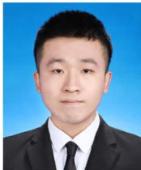

# 高柱亮  

  

18811733653|2008fssy201@163.com  
26岁丨广东佛山丨中共党员  
在职「广州、佛山  

# 教育经历  

北京科技大学－计算机技术硕士计算机与通信工程学院 2021年09月-2024年06月主要研究方向为自然语言处理；负责一项国家自然科学基金项目的研究，发表1篇SCI论文和3篇中文论文北京科技大学－信息与计算科学本科数理学院 2017年09月-2021年06月GPA3.24，加权83.8。主修：数学分析、高等代数、数据结构、多元统计分析、机器学习、数据库、数值分析、运筹学  

# 工作经历  

季华实验室-软件工程师新型显示技术研究部负责项目大数据模块。  

2024年07月－至今  

1、实施日志记录策略，设计日志存储与分析系统，整合ELK平台，在QT中集成Elasticsearch，开发存储系统，实现日志数据的实时采集、处理和分析，提高系统稳定性和运维响应速度。  
2、本地化部署Deepseek并融合RAG技术，实现代码项目自动分析，辅助定位内存泄漏、指针溢出、多线程死锁等 bug。3、搭建基于Ceph的分布式存储集群，解决大图片存储的高扩展性和高可用性需求，确保海量数据的稳定存储与快速访问。中国工商银行股份有限公司广州分行（实习）-数据实习生资产负债与管理信息部 2023年07月-2023年08月以对公客户拓展目标为核心，收集广州企业工商注册数据340万条，进行数据统计分析，研究企业注册数量趋势，撰写分析报告招商银行股份有限公司佛山分行（实习）-开发助理信息技术部 2022年07月-2022年08月基于低代码平台，设计数字化门户，完成指定场景的开发测试  
北京人寿保险股份有限公司北京分公司（实习）－数据分析员审计监察部 2021年07月－2021年08月对公司的保单信息、打卡信息、人员信息等进行分析，找出异常保单、异常打卡情况等  

# 科研/项目经历  

基于深度学习的智慧分诊管理模型优化策略研究（国自然基金项目）-核心研究员 2021年11月－2023年11月  

1、基于深度学习，运用文本分类方法，设计与开发一个智慧分诊系统；  

2、分析北京天坛医院神经科500万条病例数据，进行分词、清洗、标准化、特征提取等数据预处理；  
3、从多标签文本分类、数据不均衡、类重叠等方向解决病例数据集问题，掌握机器学习、自然语言处理等技术；  
4、利用实体抽取、实体对齐等技术在Neo4j数据库上构建医学知识图谱；  
5、对BERT模型进行改进，融入prompt等思想，提高分类性能；  
6、发表SCi论文《ADisease-Prediction ProtocolIntegratingTriage Priorityand BERT-BasedTransfer LearningforIntelligentTriage》（SCIQ2；IF:5.046）；发表中文论文《基于代价敏感和文本分类的神经学科分诊方法研究》、《基于神经系统疾病门诊病历的医学实体识别模型研究》、《基于知识图谱的神经外科疾病亚专科智慧分诊系统设计》  

# 专业技能  

·具备良好的计算机和数学基础，理解常用的各类数据分析模型及算法，善于从数据中发现并解决问题；  
·熟悉Linux环境下常用命令的使用，熟悉docker工具等；熟练使用Python脚本语言；熟悉TensorFlow、PyTorch等框架；  
：熟悉NLP大模型原理，熟悉文本分类、知识图谱等工程实现；熟练掌握Deepseek等本地化部署，熟悉BERT、GPT等模型；  
熟悉RAG模式；  
·熟练掌握sQL语法，掌握Hadoop、Hive、Ceph等大数据工具；  
·熟练掌握Elasticsearch，通过Logstash和Filebeat进行日志数据的实时采集、传输和存储，使用Kibana进行数据可视化和分析；  
： $\pmb { C } + +$ /QT项目开发经验。  
·熟练掌握Java语言，熟悉相关开发框架，熟悉计算机数据结构及常见算法分析，如排序、回溯、动态规划等；  

# 实践经历  

雀儿阳光病房学校志愿项目－志愿者 2017年11月－2022年06月为白血病儿童带去陪伴，累计参与50余次志愿活动，陪伴超过30名儿童，志愿工时近500个  
北京科技大学数理学院学生会－学生会主席 2019年07月－2020年08月1、组织、统筹与监督学生代表大会、吾肆放歌等各种活动20余场；2、主持学生会工作，协调学生会各部门之间的工作；3、统筹规划2019年迎新活动，辅助学院200余名新生入学报道  

# 语言/技术栈/荣誉/兴趣  

·语言：英语（CET-6），粤语  
·技术栈：Python、 $C + +$ 、SQL、C#、Office、数据分析、Java、Matlab  
·荣誉：首都高校羽毛球锦标赛第五名（2017）、人民三等奖学金（2018）、全国数学建模竞赛北京市一等奖（2019）、校十佳志愿者（2019）、服务保障国庆70周年活动贡献奖（2019）、优秀共青团干部（2020）、优秀研究生干部（2022）、学院特种奖学金（2023）、优秀研究生毕业生（2024）  
·兴趣爱好：围棋、羽毛球（高中和大学担任羽毛球协会会长）  