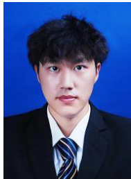

1ce20c9fa511d5c91XZ62Ni0F1NWyom6Wf-fWO2mmfLTPxRq  

# 基本信息  

姓 名：张 锦 年 龄：25 住 址：四川省巴中市学 历：硕 士 联系方式：17608274346 邮 箱：1058410192 @qq.com  

# 教育背景  

  

2022.09-至今 华东交通大学 软件工程 | 研究生（副班长）  
2018.09-2022.06 成都信息工程大学 物联网工程 | 本科  

# 实习经历  

# 广州衣神科技有限公司 SEC EDGAR 文件代理 RAG 财务分析系统开发  

2025.3 -至今  

 项目介绍：查询解析模块：基于用户问题自动识别目标公司、时间范围及需检索的文档类型。（1）动态检索优化：结合语义搜索（Qdrant向量库）与关键词检索，定位相关文本块。（2）自纠正机制：通过 LLM 对检索结果进行相关性打分，过滤低质量内容；若数据不足，自动触发回退检索（如切换至 8-K 文件或财报电话记录）。（3）多文档综合分析：针对跨周期、跨章节的查询（如收入增长趋势），聚合多个文件的数据块，生成结构化输出或叙述性分析报告。  
 项目成果：在标普 500 公司数据集测试中，系统回答财务指标类问题的准确率达 $92 \%$ （对比人工标注），单次查询平均耗时 $< 3 0$ 秒。关键创新点：通过元数据引导的检索策略和迭代式自我修正，减少传统 RAG 的幻觉问题，确保答案均源自 SEC 文件原文。  
 技术栈：OpenAI , RAG, Lang Chain, Agent, Qdrant, FastAPI,redis。  

# 科研与项目经历  

# 算命大师模型微调（基于 DeepSeek）  

# 代码设计/模型训练  

2025.2 -2025.3  

 项目介绍：通过使用 Colab 和 Unsloth 进行本地微调大语言模型 DeepSeek-R1-Distill-Llama-8B，微调了一个专业的算命大师模型，能够根据用户输入的生辰八字、面相、手相等信息，生成符合命理学逻辑的个性化回答。同时使用 Ollama 将微调后的模型部署到本地服务器，提供交互式算命服务，最后将模型上传到 Hugging Face Hub，便于共享和后续迭代。  
 项目成果：处理 $\scriptstyle 1 0 0 0 +$ 条数据，回答准确率提升 $30 \%$ ，支持用户通过命令行或 API 进行算命咨询。  
 技术栈：Python, Hugging Face Transformers, PyTorch, Colab, Unsloth, Ollama。  

# 基于 Agent 的算命大师(RAG $^ +$ Agent）  

2025.1 - 2025.3  

 项目介绍：基于 RAG 和 Agent 架构，结合 LangChain 框架，Agent 能够根据用户输入的生辰八字、面相、手相等信息，通过ChatOpenAI 作为核心语言模型，结合 RAG 技术 实现实时搜索和本地知识库检索，生成符合命理学逻辑的个性化回答。使用Qdrant 作为向量数据库构建本地知识库，支持高效的知识检索与更新，同时开发 Agent 工具链，集成情绪识别、实时搜索和知识库检索功能，优化决策流程，显著提升任务执行的效率和准确性。此外，系统支持从 URL、PDF 和文本中学习知识，通过LangChain 的文档加载和向量化工具，持续丰富知识库。  
$\bullet$ 技术栈：OpenAI , RAG, Lang Chain, Agent, Qdrant, FastAPI,redis 。  

# 轻量级可解释性医学影像诊断系统  

算法设计/系统开发 2023.10 -2024.11  

 算法介绍：（1）针对眼底图像分割任务，通过结合 U-Net 架构、Transformer 和注意力机制提出了一种创新的 MSM-TDE 模型从多样化、多视角的多尺度特征挖掘角度改进了传统分割方法。在四个公开的眼底数据集上进行数据增强和模型训练与测试，模型的分割敏感度（Se）均超过 $8 3 \%$ ，显著优于现有方法。（2）针对眼底图像分割任务，从边界特征引导的角度出发，结合Cross Attention和Knowledge Distillation。提出了一种创新的 EGU-Net 模型，显著提升了眼底图像分割的精度与鲁棒性。在多个公开眼底数据集上进行实验，模型在分割精度、边界连续性等指标上均表现优异，验证了边界特征挖掘、引导和交互策略的有效性。  

 技术栈：PyTorch, U-Net, Transformer, Attention Mechanism, NumPy, Docker,Java,SpringBoot,Spring MVC，MySQL。  

 项目成果：发表 SCI 二区(中科院分区)论文。并在南昌二附院的实际应用中显著提高了诊断效率，为眼科疾病治疗提供了可靠支持。个人技能  

 熟悉机器学习、深度学习等人工智能领域基础算法。  

$\bigstar$ 熟悉 java、SpringMVC、SpringBoot 等主流后端开发框架和 MySQL 数据库。了解 Linux 、Docker、Git 的基础使用。$\ \cdot$ 熟悉常见的数据结构算法，比如排序，查找，数组，链表等  

# 竞赛获奖  

 发明专利：一种基于多尺度特征增强的眼底图像分割方法与系统 编号：2023SR1797776 科研论文：Multi-scale Semantics Mining and Tiny Details Enhancement Network（SCI 二区 IF：6.1）  

江西省奖学金  

 江西省研究生数学建模比赛二等奖 CET-4，CET-6。  

校级一等、二等学业奖学金，  